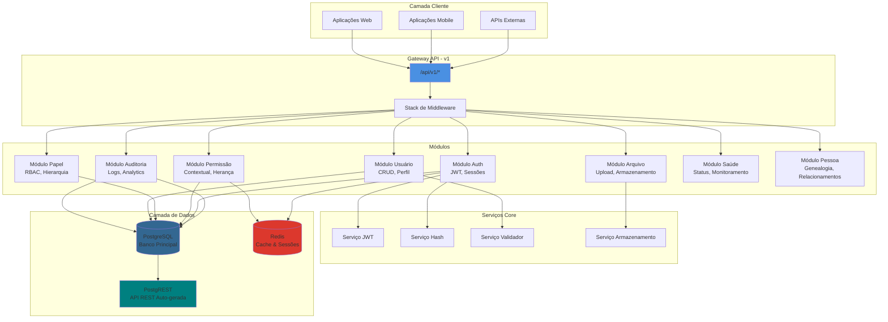
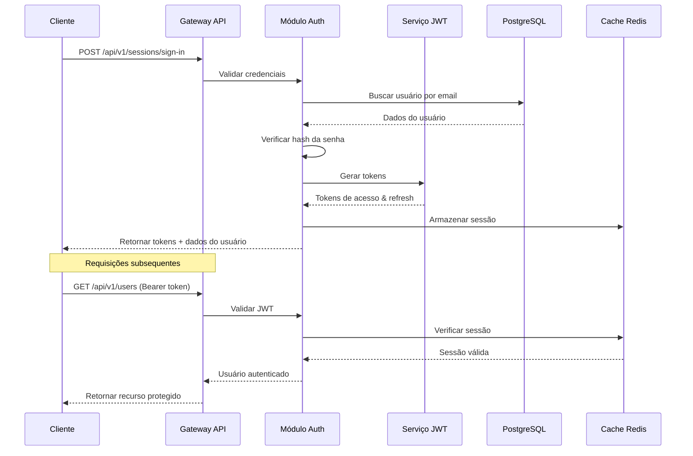
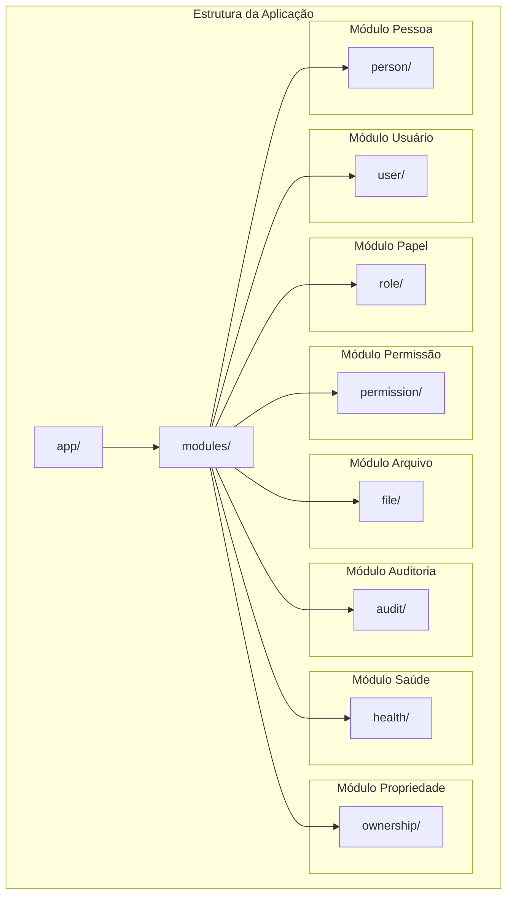
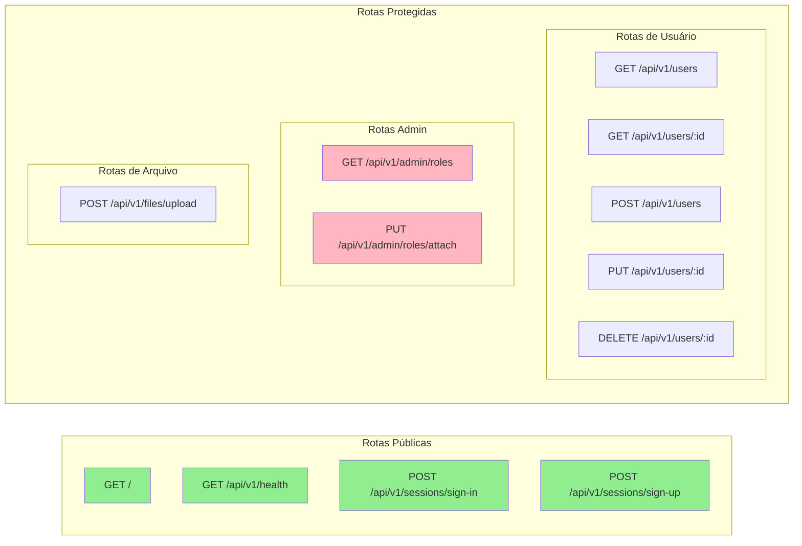
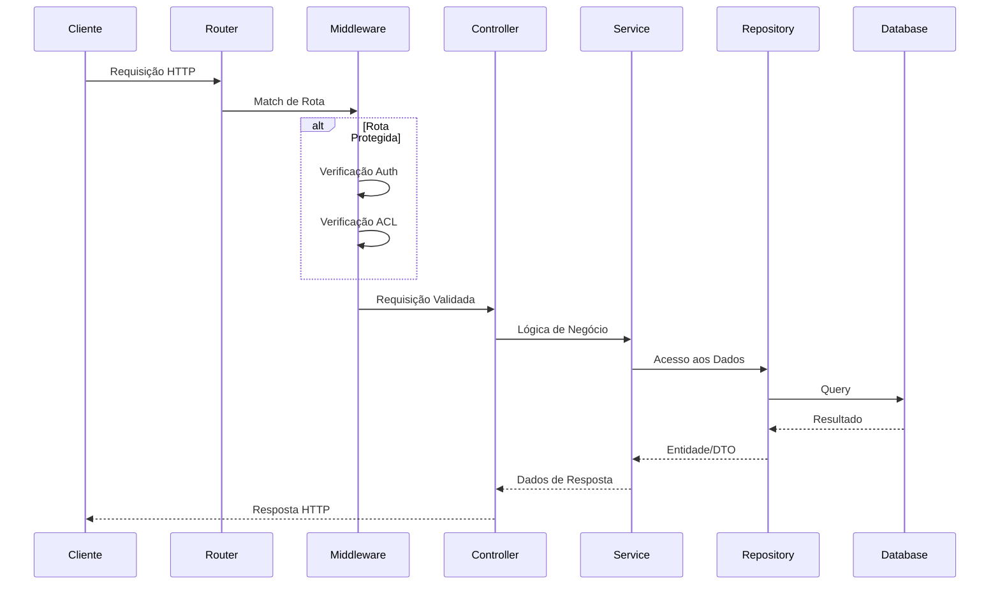
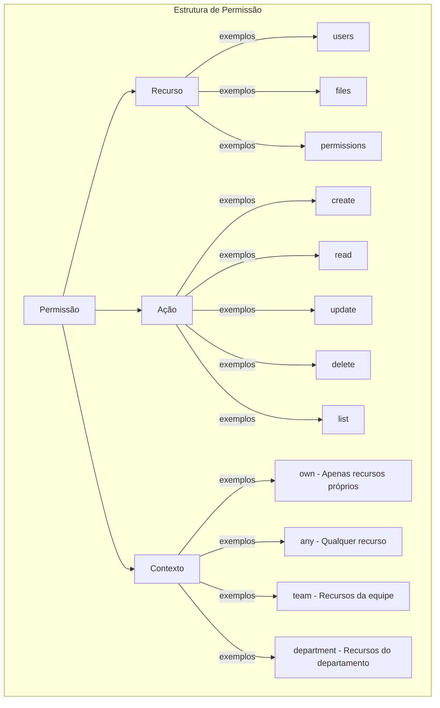

<h1 align="center">
  
</h1>

<p align="center">
  
  
  
  
  
  <a href="https://github.com/gabrielmaialva33/genscan/commits/master">
    
    
  </a>
</p>

<br>

<p align="center">
    <a href="README.md">English</a>
    ·
    <a href="README-pt.md">Portuguese</a>
</p>

<p align="center">
  <a href="#bookmark-about">Sobre</a>&nbsp;&nbsp;&nbsp;|&nbsp;&nbsp;&nbsp;
  <a href="#computer-technologies">Tecnologias</a>&nbsp;&nbsp;&nbsp;|&nbsp;&nbsp;&nbsp;
  <a href="#wrench-tools">Ferramentas</a>&nbsp;&nbsp;&nbsp;|&nbsp;&nbsp;&nbsp;
  <a href="#package-installation">Instalação</a>&nbsp;&nbsp;&nbsp;|&nbsp;&nbsp;&nbsp;
  <a href="#memo-license">Licença</a>
</p>

<br>

## :bookmark: Sobre

**genscan** é uma API modular para escaneamento e análise genealógica, construída com AdonisJS v6. Ela fornece uma base
robusta para autenticação, controle de acesso baseado em papéis e gerenciamento de dados genealógicos, permitindo a
construção e visualização de árvores genealógicas complexas. A API segue princípios de arquitetura limpa com uma clara
separação de responsabilidades, garantindo escalabilidade e manutenibilidade.

### 🏗️ Visão Geral da Arquitetura



### 🔐 Fluxo de Autenticação



### 📁 Estrutura Modular



## 🌟 Principais Funcionalidades

### Funcionalidades Core

- **🔐 Autenticação JWT**: Autenticação segura baseada em tokens com refresh tokens
- **👥 Controle de Acesso Baseado em Papéis**: Permissões refinadas com papéis ROOT, ADMIN, USER, EDITOR e GUEST
- **📁 Arquitetura Modular**: Clara separação de responsabilidades com módulos de funcionalidades
- **🗄️ PostgreSQL**: Banco de dados robusto e confiável
- **🚀 API RESTful**: Endpoints bem estruturados seguindo princípios REST
- **📤 Upload de Arquivos**: Manipulação segura de arquivos com múltiplos drivers de armazenamento
- **🏥 Monitoramento de Saúde**: Endpoints integrados para verificação de saúde
- **🔒 Segurança em Primeiro Lugar**: Hash de senhas, CORS, rate limiting pronto
- **📝 Validação de Requisições**: DTOs com validação em tempo de execução
- **🌐 Pronto para i18n**: Suporte a internacionalização integrado
- **🔗 Integração PostgREST**: API REST auto-gerada para acesso direto ao banco

### Funcionalidades Avançadas de ACL

- **🎯 Permissões Contextuais**: Suporte para contextos `own`, `any`, `team` e `department`
- **🔄 Herança de Permissões**: Herança automática de permissões através da hierarquia de papéis
- **📋 Trilha de Auditoria Completa**: Rastreamento de todas as verificações de permissão e tentativas de acesso
- **⚡ Permissões em Cache Redis**: Verificação de permissões de alta performance com cache inteligente
- **🏢 Propriedade de Recursos**: Sistema de propriedade integrado com suporte a contextos de equipe e departamento
- **🔍 Controle Granular de Permissões**: Sistema de permissões baseado em Recurso + Ação + Contexto

### Funcionalidades Genealógicas

- **👨‍👩‍👧‍👦 Gestão de Indivíduos**: Cadastro e gerenciamento de perfis pessoais detalhados, incluindo informações
  demográficas.
- **🔗 Mapeamento de Relacionamentos**: Definição de laços familiares complexos (pais, filhos, cônjuges, etc.) para
  construir árvores genealógicas.
- **📞 Armazenamento de Contatos e Endereços**: Centralização de informações de contato e múltiplos endereços por
  indivíduo.
- **🧩 Estrutura de Dados Flexível**: Suporte para dados externos e informações adicionais através de campos JSON,
  permitindo fácil integração com outras fontes.

### Esquema do Banco de Dados

```mermaid
erDiagram
    USERS ||--o{ AUTH_ACCESS_TOKENS : "possui"
    USERS ||--o{ USER_ROLES : "possui"
    ROLES ||--o{ USER_ROLES : "possui"
    USERS ||--o{ USER_PERMISSIONS : "possui"
    PERMISSIONS ||--o{ USER_PERMISSIONS : "é parte de"
    ROLES ||--o{ ROLE_PERMISSIONS : "possui"
    PERMISSIONS ||--o{ ROLE_PERMISSIONS : "é parte de"
    USERS ||--o{ FILES : "envia"
    USERS ||--o{ AUDIT_LOGS : "gera"
    PEOPLES ||--o{ RELATIONSHIPS : "inicia"
    PEOPLES ||--o{ RELATIONSHIPS : "é alvo de"
    PEOPLES ||--o{ CONTACTS : "possui"
    PEOPLES ||--o{ ADDRESSES : "possui"

    USERS {
        int id PK
        string full_name
        string email UK
        string username UK
        string password
        boolean is_deleted
        jsonb metadata
    }

    AUTH_ACCESS_TOKENS {
        int id PK
        int tokenable_id FK "USERS(id)"
        string type
        string hash
        text abilities
        timestamp expires_at
    }

    ROLES {
        int id PK
        string name
        string slug UK
        text description
    }

    USER_ROLES {
        int id PK
        int user_id FK "USERS(id)"
        int role_id FK "ROLES(id)"
    }

    PERMISSIONS {
        int id PK
        string name UK
        string resource
        string action
        string context
        string description
    }

    ROLE_PERMISSIONS {
        int id PK
        int role_id FK "ROLES(id)"
        int permission_id FK "PERMISSIONS(id)"
    }

    USER_PERMISSIONS {
        int id PK
        int user_id FK "USERS(id)"
        int permission_id FK "PERMISSIONS(id)"
        boolean granted
        timestamp expires_at
    }

    FILES {
        int id PK
        int owner_id FK "USERS(id)"
        string client_name
        string file_name
        int file_size
        string file_type
        string file_category
        string url
    }

    AUDIT_LOGS {
        int id PK
        int user_id FK "USERS(id)"
        string resource
        string action
        string result
        string reason
        string ip_address
        string user_agent
        json metadata
    }

    PEOPLES {
        uuid id PK
        string name
        string cpf_hash UK
        string email
        date birth_date
        string gender
        string marital_status
        jsonb external_data
    }

    RELATIONSHIPS {
        uuid id PK
        uuid person_id FK "PEOPLES(id)"
        uuid related_person_id FK "PEOPLES(id)"
        string relationship_type
    }

    CONTACTS {
        uuid id PK
        uuid person_id FK "PEOPLES(id)"
        string phone_number
        string email
    }

    ADDRESSES {
        uuid id PK
        uuid person_id FK "PEOPLES(id)"
        string street
        string city
        string state
        string zip_code
        string neighborhood
    }
```



<br>

## :computer: Tecnologias

- **[Typescript](https://www.typescriptlang.org/)**
- **[Node.js](https://nodejs.org/)**
- **[AdonisJS](https://adonisjs.com/)**
- **[PostgreSQL](https://www.postgresql.org/)**
- **[Redis](https://redis.io/)** - Armazenamento de dados em memória
- **[PostgREST](https://postgrest.org/)** - API REST auto-gerada
- **[Docker](https://www.docker.com/)**

<br>

## :wrench: Ferramentas

- **[WebStorm](https://www.jetbrains.com/webstorm/)**
- **[Insomnia](https://insomnia.rest/)**
- **[DataGrip](https://www.jetbrains.com/datagrip/)**

<br>

## :package: Instalação

### :heavy_check_mark: **Pré-requisitos**

Os seguintes softwares devem estar instalados:

- **[Node.js](https://nodejs.org/en/)**
- **[Git](https://git-scm.com/)**
- **[NPM](https://www.npmjs.com/)** or **[Yarn](https://yarnpkg.com/)**
- **[PostgreSQL](https://www.postgresql.org/download/)** or **[Docker](https://www.docker.com/get-started/)**

<br>

### :arrow_down: **Clonando o repositório**

```sh
  $ git clone https://github.com/gabrielmaialva33/genscan.git
```

<br>

### :arrow_forward: **Rodando o backend**

- :package: API

```sh
  $ cd genscan
  # Instalação de dependências.
  $ yarn # ou npm install
  # Configuração ambiente de sistema
  $ cp .env.example .env
  # Criação de banco de dados.
  $ node ace migration:run # ou docker-compose up --build
  # Iniciar API
  $ node ace serve --hmr # ou pnpm dev
```

<br>

## :twisted_rightwards_arrows: Rotas da API

A API é versionada e todos os endpoints são prefixados com `/api/v1/`. Abaixo está a estrutura completa de rotas:

### 🛣️ Organização das Rotas



### 📋 Detalhes das Rotas

| Método     | Endpoint                                    | Descrição                           | Auth Obrigatória | Permissão/Papel    |
|------------|---------------------------------------------|-------------------------------------|------------------|--------------------|
| **GET**    | `/`                                         | Informações da API                  | ❌                | -                  |
| **GET**    | `/api/v1/health`                            | Verificação de saúde                | ❌                | -                  |
| **POST**   | `/api/v1/sessions/sign-in`                  | Login de usuário                    | ❌                | -                  |
| **POST**   | `/api/v1/sessions/sign-up`                  | Registro de usuário                 | ❌                | -                  |
| **GET**    | `/api/v1/verify-email`                      | Verificar email do usuário          | ❌                | -                  |
| **POST**   | `/api/v1/resend-verification-email`         | Reenviar email de verificação       | ✅                | -                  |
| **GET**    | `/api/v1/me`                                | Obter perfil do usuário atual       | ✅                | -                  |
| **GET**    | `/api/v1/me/permissions`                    | Obter permissões do usuário atual   | ✅                | -                  |
| **GET**    | `/api/v1/me/roles`                          | Obter papéis do usuário atual       | ✅                | -                  |
| **GET**    | `/api/v1/users`                             | Listar usuários (paginado)          | ✅                | users.list         |
| **GET**    | `/api/v1/users/:id`                         | Obter usuário por ID                | ✅                | users.read         |
| **POST**   | `/api/v1/users`                             | Criar usuário                       | ✅                | users.create       |
| **PUT**    | `/api/v1/users/:id`                         | Atualizar usuário                   | ✅                | users.update       |
| **DELETE** | `/api/v1/users/:id`                         | Deletar usuário                     | ✅                | users.delete       |
| **GET**    | `/api/v1/admin/roles`                       | Listar papéis                       | ✅                | ROOT, ADMIN        |
| **PUT**    | `/api/v1/admin/roles/attach`                | Atribuir papel ao usuário           | ✅                | ROOT, ADMIN        |
| **GET**    | `/api/v1/admin/permissions`                 | Listar permissões                   | ✅                | permissions.list   |
| **POST**   | `/api/v1/admin/permissions`                 | Criar permissão                     | ✅                | permissions.create |
| **PUT**    | `/api/v1/admin/roles/permissions/sync`      | Sincronizar permissões do papel     | ✅                | permissions.update |
| **PUT**    | `/api/v1/admin/roles/permissions/attach`    | Anexar permissões ao papel          | ✅                | permissions.update |
| **PUT**    | `/api/v1/admin/roles/permissions/detach`    | Desanexar permissões do papel       | ✅                | permissions.update |
| **PUT**    | `/api/v1/admin/users/permissions/sync`      | Sincronizar permissões do usuário   | ✅                | permissions.update |
| **GET**    | `/api/v1/admin/users/:id/permissions`       | Obter permissões diretas do usuário | ✅                | permissions.list   |
| **POST**   | `/api/v1/admin/users/:id/permissions/check` | Verificar permissões do usuário     | ✅                | permissions.list   |
| **POST**   | `/api/v1/files/upload`                      | Upload de arquivo                   | ✅                | files.create       |

### 🔄 Fluxo de Requisição/Resposta



### 🔐 Sistema de Permissões

O sistema avançado de permissões suporta controle de acesso contextual:



#### Hierarquia de Papéis e Herança

```
ROOT
├── ADMIN (herda todas as permissões ROOT)
│   ├── USER (herda permissões básicas ADMIN)
│   │   └── GUEST (herda permissões limitadas USER)
│   └── EDITOR (herda permissões de conteúdo ADMIN)
       └── USER (herda de EDITOR)
```

#### Exemplos de Contexto

- `users.update.own` - Pode atualizar apenas o próprio perfil
- `users.update.any` - Pode atualizar qualquer usuário
- `files.delete.team` - Pode deletar arquivos de membros da equipe
- `reports.read.department` - Pode ler relatórios do próprio departamento

### 📥 Coleção Insomnia

Obtenha a coleção completa da API para o
Insomnia: [Download](https://raw.githubusercontent.com/gabrielmaialva33/genscan/master/.github/assets/insomnia/Insomnia.json.zip)

## :memo: Licença

O projeto está sobre a licença [MIT](./LICENSE) ❤️

Gostou? Deixe uma estrela para ajudar o projeto ⭐

<br>

<p align="center">
  
</p>

<p align="center">
  &copy; 2017-present <a href="https://github.com/gabrielmaialva33/" target="_blank">Maia</a>
</p>
