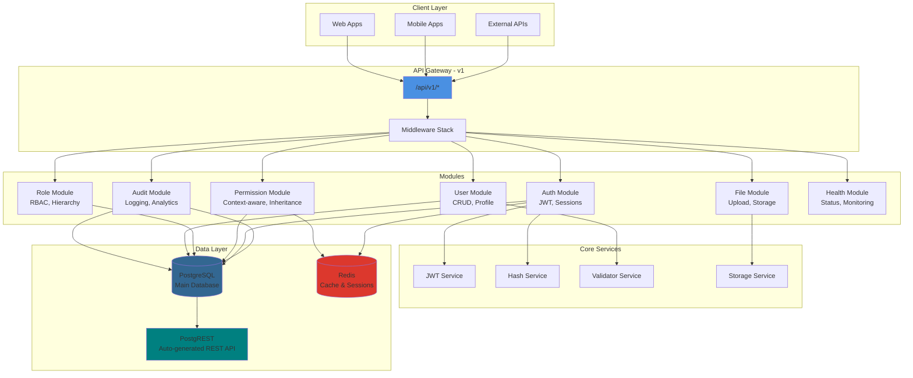
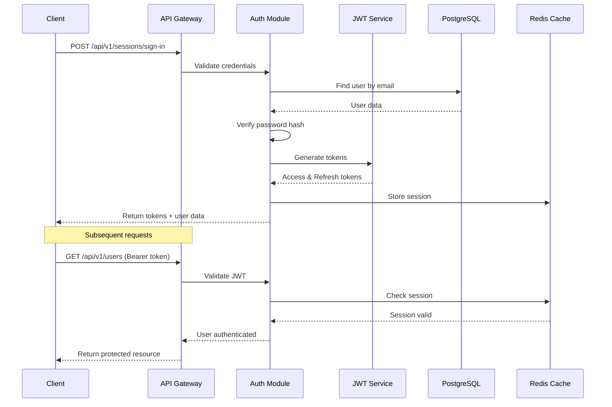
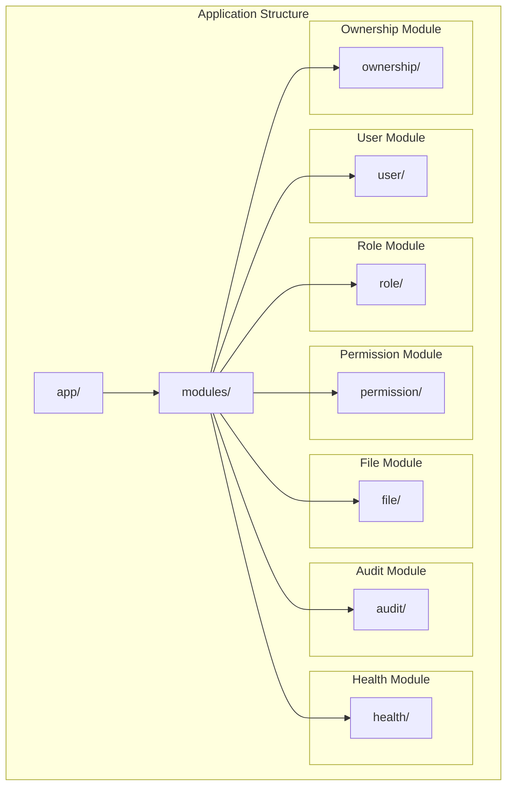
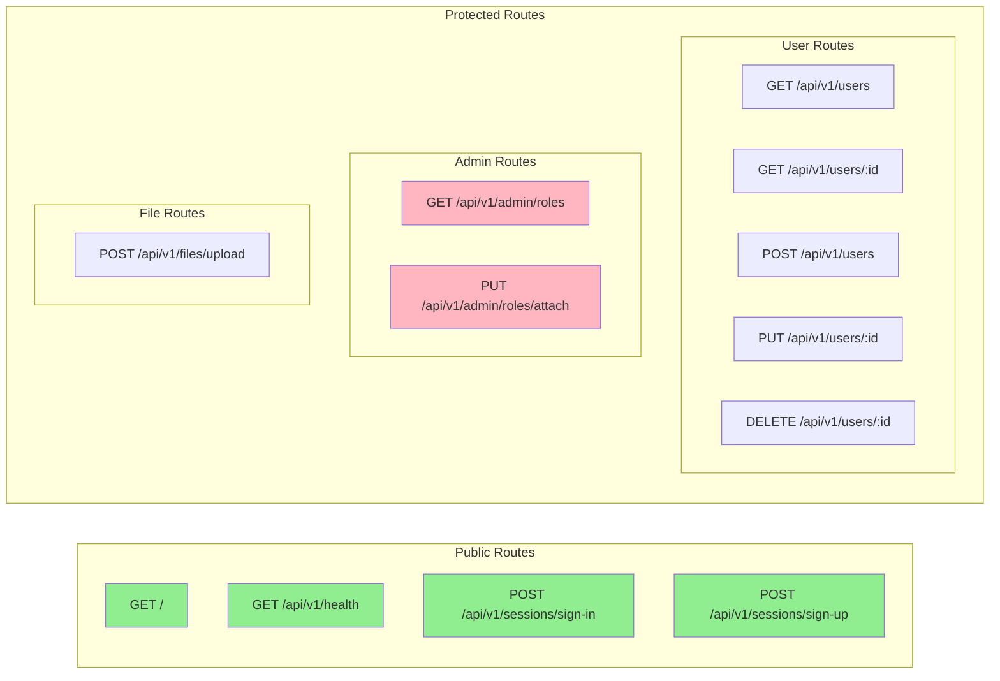
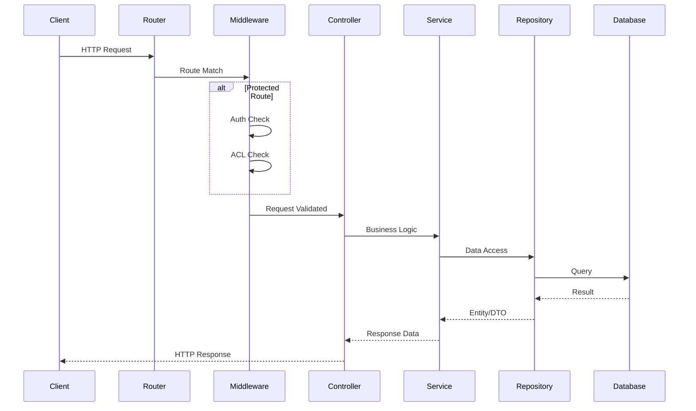
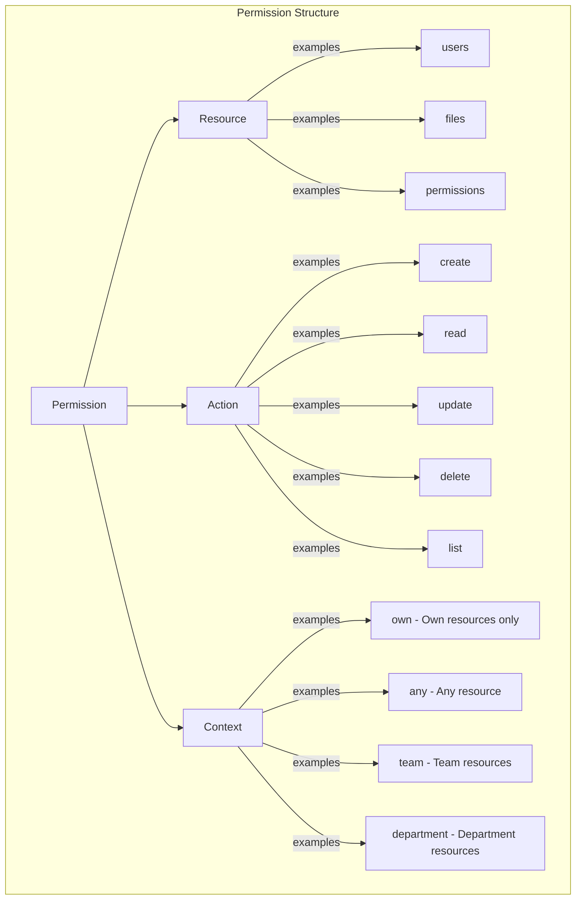

<h1 align="center">
  
</h1>

<p align="center">
  
  
  
  
  
  <a href="https://github.com/gabrielmaialva33/genscan-api/commits/master">
    
      
  </a>
</p>

<br>

<p align="center">
    <a href="README.md">English</a>
    ·
    <a href="README-pt.md">Portuguese</a>
</p>

<p align="center">
  <a href="#bookmark-about">About</a>&nbsp;&nbsp;&nbsp;|&nbsp;&nbsp;&nbsp;
  <a href="#computer-technologies">Technologies</a>&nbsp;&nbsp;&nbsp;|&nbsp;&nbsp;&nbsp;
  <a href="#wrench-tools">Tools</a>&nbsp;&nbsp;&nbsp;|&nbsp;&nbsp;&nbsp;
  <a href="#package-installation">Installation</a>&nbsp;&nbsp;&nbsp;|&nbsp;&nbsp;&nbsp;
  <a href="#memo-license">License</a>
</p>

<br>

## :bookmark: About

**genscan-api** is a modular API for genealogical scanning and analysis, built with AdonisJS v6. It provides a robust foundation for authentication, role-based access control, and management of genealogical data. The API follows clean architecture principles with a clear separation of concerns.

### 🏗️ Architecture Overview



### 🔐 Authentication Flow



### 📁 Module Structure



## 🌟 Key Features

### Core Features

- **🔐 JWT Authentication**: Secure token-based authentication with refresh tokens
- **👥 Role-Based Access Control**: Fine-grained permissions with ROOT, ADMIN, USER, EDITOR, and GUEST roles
- **📁 Modular Architecture**: Clean separation of concerns with feature modules
- **🗄️ PostgreSQL**: Robust and reliable database
- **🚀 RESTful API**: Well-structured endpoints following REST principles
- **📤 File Uploads**: Secure file handling with multiple storage drivers
- **🏥 Health Monitoring**: Built-in health check endpoints
- **🔒 Security First**: Password hashing, CORS, rate limiting ready
- **📝 Request Validation**: DTOs with runtime validation
- **🌐 i18n Ready**: Internationalization support built-in
- **🔗 PostgREST Integration**: Auto-generated REST API for direct database access

### Advanced ACL Features

- **🎯 Context-Aware Permissions**: Support for `own`, `any`, `team`, and `department` contexts
- **🔄 Permission Inheritance**: Automatic permission inheritance through role hierarchy
- **📋 Comprehensive Audit Trail**: Track all permission checks and access attempts
- **⚡ Redis-Cached Permissions**: High-performance permission checking with intelligent caching
- **🏢 Resource Ownership**: Built-in ownership system supporting team and department contexts
- **🔍 Granular Permission Control**: Resource + Action + Context based permission system

### Database Schema

```mermaid
erDiagram
    USERS ||--o{ AUTH_ACCESS_TOKENS : "has"
    USERS ||--o{ USER_ROLES : "has"
    ROLES ||--o{ USER_ROLES : "has"
    USERS ||--o{ USER_PERMISSIONS : "has"
    PERMISSIONS ||--o{ USER_PERMISSIONS : "is part of"
    ROLES ||--o{ ROLE_PERMISSIONS : "has"
    PERMISSIONS ||--o{ ROLE_PERMISSIONS : "is part of"
    USERS ||--o{ FILES : "uploads"
    USERS ||--o{ AUDIT_LOGS : "generates"
    PEOPLES ||--o{ RELATIONSHIPS : "initiates"
    PEOPLES ||--o{ RELATIONSHIPS : "is target of"
    PEOPLES ||--o{ CONTACTS : "has"
    PEOPLES ||--o{ ADDRESSES : "has"

    USERS {
        int id PK
        string full_name
        string email UK
        string username UK
        string password
        boolean is_deleted
        jsonb metadata
    }

    AUTH_ACCESS_TOKENS {
        int id PK
        int tokenable_id FK "USERS(id)"
        string type
        string hash
        text abilities
        timestamp expires_at
    }

    ROLES {
        int id PK
        string name
        string slug UK
        text description
    }

    USER_ROLES {
        int id PK
        int user_id FK "USERS(id)"
        int role_id FK "ROLES(id)"
    }

    PERMISSIONS {
        int id PK
        string name UK
        string resource
        string action
        string context
        string description
    }

    ROLE_PERMISSIONS {
        int id PK
        int role_id FK "ROLES(id)"
        int permission_id FK "PERMISSIONS(id)"
    }

    USER_PERMISSIONS {
        int id PK
        int user_id FK "USERS(id)"
        int permission_id FK "PERMISSIONS(id)"
        boolean granted
        timestamp expires_at
    }

    FILES {
        int id PK
        int owner_id FK "USERS(id)"
        string client_name
        string file_name
        int file_size
        string file_type
        string file_category
        string url
    }

    AUDIT_LOGS {
        int id PK
        int user_id FK "USERS(id)"
        string resource
        string action
        string result
        string reason
        string ip_address
        string user_agent
        json metadata
    }

    PEOPLES {
        uuid id PK
        string name
        string cpf_hash UK
        string email
        date birth_date
        string gender
        string marital_status
        jsonb external_data
    }

    RELATIONSHIPS {
        uuid id PK
        uuid person_id FK "PEOPLES(id)"
        uuid related_person_id FK "PEOPLES(id)"
        string relationship_type
    }

    CONTACTS {
        uuid id PK
        uuid person_id FK "PEOPLES(id)"
        string phone_number
        string email
    }

    ADDRESSES {
        uuid id PK
        uuid person_id FK "PEOPLES(id)"
        string street
        string city
        string state
        string zip_code
        string neighborhood
    }
```



<br>

## :computer: Technologies

- **[Typescript](https://www.typescriptlang.org/)**
- **[Node.js](https://nodejs.org/)**
- **[AdonisJS](https://adonisjs.com/)**
- **[PostgreSQL](https://www.postgresql.org/)**
- **[Redis](https://redis.io/)** - In-memory data store
- **[PostgREST](https://postgrest.org/)** - Auto-generated REST API
- **[Docker](https://www.docker.com/)**

<br>

## :wrench: Tools

- **[WebStorm](https://www.jetbrains.com/webstorm/)**
- **[Insomnia](https://insomnia.rest/)**
- **[DataGrip](https://www.jetbrains.com/datagrip/)**

<br>

## :package: Installation

### :heavy_check_mark: **Prerequisites**

The following software must be installed:

- **[Node.js](https://nodejs.org/en/)**
- **[Git](https://git-scm.com/)**
- **[NPM](https://www.npmjs.com/)** or **[Yarn](https://yarnpkg.com/)**
- **[PostgreSQL](https://www.postgresql.org/download/)** or **[Docker](https://www.docker.com/get-started/)**

<br>

### :arrow_down: **Cloning the repository**

```sh
  $ git clone https://github.com/gabrielmaialva33/genscan-api.git
```

<br>

### :arrow_forward: **Running the application**

- :package: API

```sh
  $ cd genscan-api
  # Dependencies install.
  $ yarn # or npm install
  # Config environment system
  $ cp .env.example .env
  # Data base creation.
  $ node ace migration:run # or docker-compose up --build
  # API start
  $ node ace serve --hmr # or pnpm dev
```

<br>

## :twisted_rightwards_arrows: API Routes

The API is versioned and all endpoints are prefixed with `/api/v1/`. Below is the complete route structure:

### 🛣️ Route Organization



### 📋 Route Details

| Method     | Endpoint                                    | Description                   | Auth Required | Permission/Role    |
| ---------- | ------------------------------------------- | ----------------------------- | ------------- | ------------------ |
| **GET**    | `/`                                         | API information               | ❌            | -                  |
| **GET**    | `/api/v1/health`                            | Health check                  | ❌            | -                  |
| **POST**   | `/api/v1/sessions/sign-in`                  | User login                    | ❌            | -                  |
| **POST**   | `/api/v1/sessions/sign-up`                  | User registration             | ❌            | -                  |
| **GET**    | `/api/v1/verify-email`                      | Verify user email             | ❌            | -                  |
| **POST**   | `/api/v1/resend-verification-email`         | Resend verification email     | ✅            | -                  |
| **GET**    | `/api/v1/me`                                | Get current user profile      | ✅            | -                  |
| **GET**    | `/api/v1/me/permissions`                    | Get current user permissions  | ✅            | -                  |
| **GET**    | `/api/v1/me/roles`                          | Get current user roles        | ✅            | -                  |
| **GET**    | `/api/v1/users`                             | List users (paginated)        | ✅            | users.list         |
| **GET**    | `/api/v1/users/:id`                         | Get user by ID                | ✅            | users.read         |
| **POST**   | `/api/v1/users`                             | Create user                   | ✅            | users.create       |
| **PUT**    | `/api/v1/users/:id`                         | Update user                   | ✅            | users.update       |
| **DELETE** | `/api/v1/users/:id`                         | Delete user                   | ✅            | users.delete       |
| **GET**    | `/api/v1/admin/roles`                       | List roles                    | ✅            | ROOT, ADMIN        |
| **PUT**    | `/api/v1/admin/roles/attach`                | Attach role to user           | ✅            | ROOT, ADMIN        |
| **GET**    | `/api/v1/admin/permissions`                 | List permissions              | ✅            | permissions.list   |
| **POST**   | `/api/v1/admin/permissions`                 | Create permission             | ✅            | permissions.create |
| **PUT**    | `/api/v1/admin/roles/permissions/sync`      | Sync role permissions         | ✅            | permissions.update |
| **PUT**    | `/api/v1/admin/roles/permissions/attach`    | Attach permissions to role    | ✅            | permissions.update |
| **PUT**    | `/api/v1/admin/roles/permissions/detach`    | Detach permissions from role  | ✅            | permissions.update |
| **PUT**    | `/api/v1/admin/users/permissions/sync`      | Sync user permissions         | ✅            | permissions.update |
| **GET**    | `/api/v1/admin/users/:id/permissions`       | Get user's direct permissions | ✅            | permissions.list   |
| **POST**   | `/api/v1/admin/users/:id/permissions/check` | Check user permissions        | ✅            | permissions.list   |
| **POST**   | `/api/v1/files/upload`                      | Upload file                   | ✅            | files.create       |

### 🔄 Request/Response Flow



### 🔐 Permission System

The advanced permission system supports context-aware access control:



#### Role Hierarchy & Inheritance

```
ROOT
├── ADMIN (inherits all ROOT permissions)
│   ├── USER (inherits basic ADMIN permissions)
│   │   └── GUEST (inherits limited USER permissions)
│   └── EDITOR (inherits content ADMIN permissions)
       └── USER (inherits from EDITOR)
```

#### Context Examples

- `users.update.own` - Can only update own profile
- `users.update.any` - Can update any user
- `files.delete.team` - Can delete files from team members
- `reports.read.department` - Can read reports from own department

### 📥 Insomnia Collection

Get the complete API collection for
Insomnia: [Download](https://raw.githubusercontent.com/gabrielmaialva33/genscan-api/master/.github/assets/insomnia/Insomnia.json.zip)

## :memo: License

This project is under the **MIT** license. [MIT](./LICENSE) ❤️

Liked? Leave a little star to help the project ⭐

<br>

<p align="center">
  
</p>

<p align="center">
  &copy; 2017-present <a href="https://github.com/gabrielmaialva33/" target="_blank">Maia</a>
</p>
